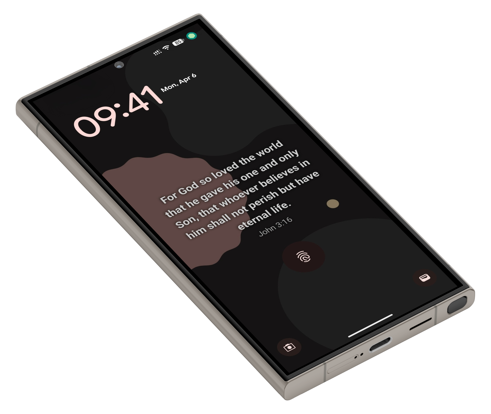
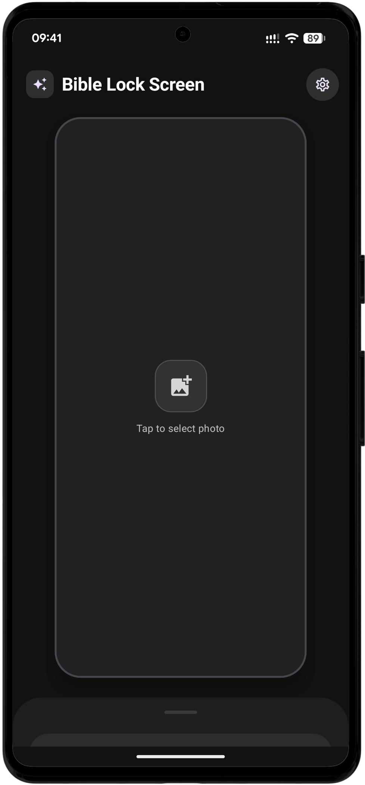
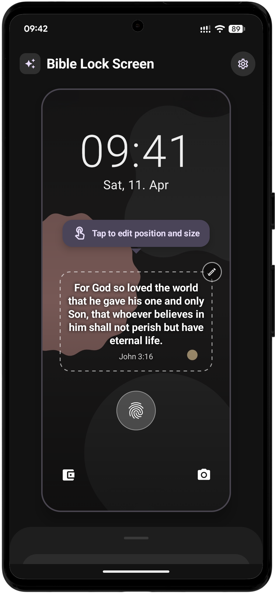
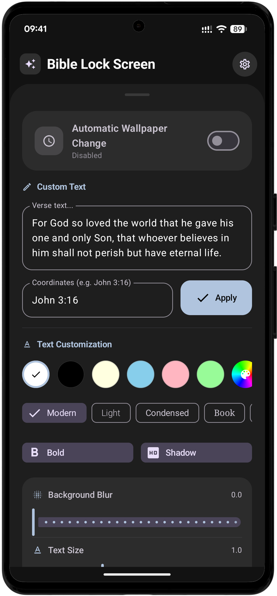
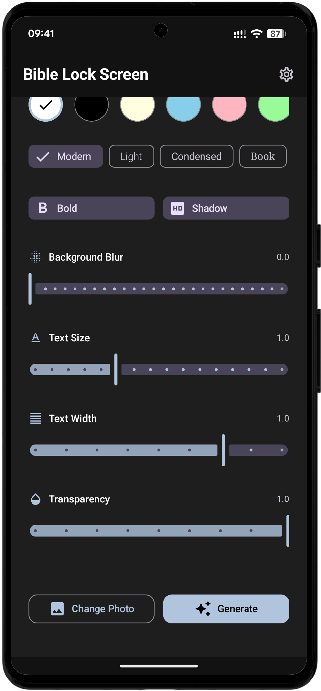
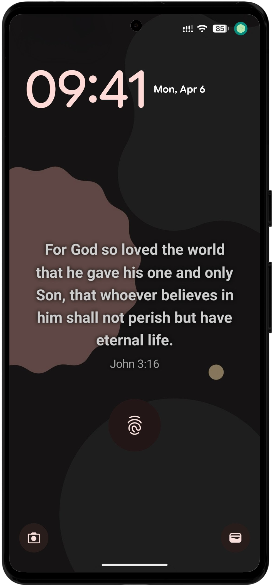

# 📖 Bible Lock Screen

> A beautiful Android app that sets a new Bible verse as your lock screen wallpaper every day.

  

  
  
  

  

  
  
  

  

---

## 🔎 HOW IT WORKS

1. **Choose Your Photo:** Select any image from your gallery to serve as the perfect canvas.
2. **Customize the Verse:** Use our powerful editor to make the text look exactly how you want. Match the color to your background, choose a font that speaks to you, and position it perfectly.
3. **Activate & Enjoy:** Turn on the daily automation. The app handles the rest, fetching the new verse and refreshing your wallpaper every morning.

You are in complete control. Whether you prefer a minimalist, clean style or a bold, expressive design, Bible Lock Screen gives you the tools to create it.

---

## ✨ Features

- **Daily Bible verse** — a new verse automatically appears on your lock screen every day at a time you choose
- **Add your own verse** - apply custom verse text and references instead of using the "Verse of the Day."
- **Fully customizable text** — adjust font size, width, color, transparency, boldness, shadow, and font style
- **Background blur** — apply a blur effect to your chosen photo for a cleaner look
- **Live wallpaper preview** — drag and resize the text widget directly in the app before applying
- **Multi-language support** — verses available in Slovak, Czech, English, and more
- **Material You theming** — supports dynamic colors, light/dark mode, and system theme
- **Works offline** — all verses are bundled locally, no internet required

---

## 🌍 Supported Languages

| Code | Language  |
|------|-----------|
| SK   | Slovak    |
| CZ   | Czech     |
| EN   | English   |
| DE   | German    |
| FR   | French    |
| ES   | Spanish   |
| IT   | Italian   |
| HU   | Hungarian |
| PL   | Polish    |

The app automatically detects your system language on first launch.

---

## 📸 Screenshots

  
  &nbsp;&nbsp;
  
  &nbsp;&nbsp;
  
  &nbsp;&nbsp;
  
  &nbsp;&nbsp;
  

---

## ☕ Support

If you like the app and want to support its development, you can buy me a coffee!

---

Made with ❤️ and faith

